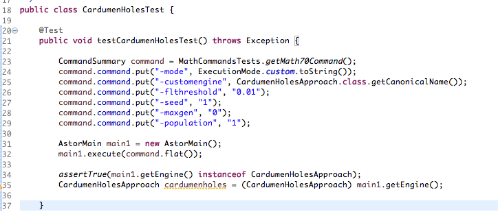
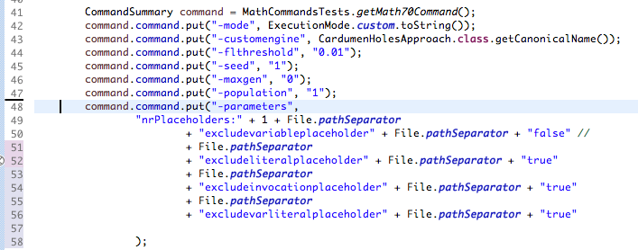
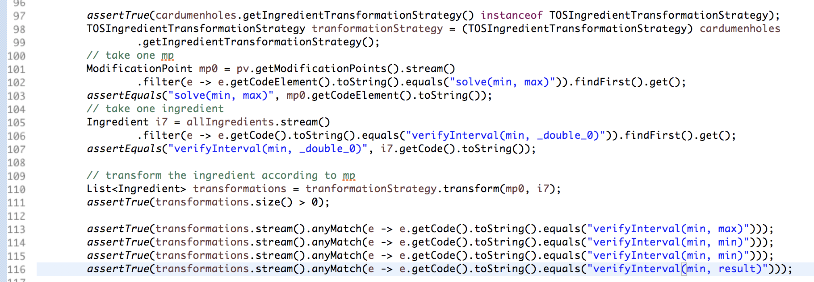
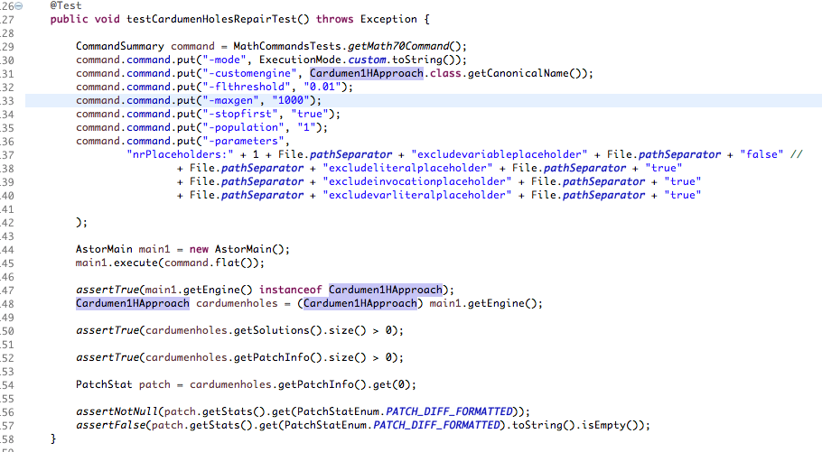

# Tutorial: how to create a repair approach over Astor.


In this tutorial we will show how to create an ingredient based repair approach that we will called 
Cardumen1H. 
Cardumen is an generate-and-validate repair approach that replace buggy suspicious expression per 
other expression synthesized from templates mined from the application under repair.
In this tutorial, a template from Cardumen1H will be a piece of code (at the level of one statement) with exactly one hole.  As difference,  the original Cardumen approach defines template with one hole per variable. Moreover, we aim that Cardumen1H navigates exhaustivelly the search space rather than selective way (i.e,, randomly) such Cardumen or jGenProg do.


## Defining Cardumen1H goals:

In our example, Cardumen1H will have:

1. Granularity of `expressions` (as the traditional Cardumen)
2. Template-based ingredients with fixed number of holes: 1.
3. Repair operator: only 1 (replacement of expressions)

## Existing components already written on Astor framework: 

1.  Cardumen working at the level of expression. 
2.  Ingredient pool containing templates where a template has one hole for each variable. That means, there is not variables, only holes (i.e., variable placeholders).

## Main steps for defining an approach over Astor

One way to  build a new approach over Astor is to:

1.  Extend from AstorCoreEngine (or any subclass)

2.  Override the default behaviour of Astor by overriding methods with prefix "load". 
For example, "loadOperatorSpaceDefinition" loads the definition of the operator space, and `loadOperatorSelectorStrategy` loads the strategy for selecting a repair operator.
Note that if those methods are not overridden in the new approaches' class (i.e., subclass of  AstorCoreEngine), Astor will load the default behaviour. For some extension points, such as Operator Selector Strategy (EP_OS),  mentioned `loadOperatorSelectorStrategy` method from AstorCoreEngine loads one strategy based on the command line argument `opselectionstrategy` (which default value is `uniform-random`). We will later detail this way of providing new functionality.

3.  In case our new approach only uses already built components (e.g, the repair operator space of GenProg and the ingredient selection strategy from DeepRepair), it's not necessary to override any `loadX()` method: it will enough to specify, for the extension point we want to change the default behaviour by another existing, the new value. All values are available HERE. We will later detail this way of specifying the component to use.


## Lifecycle of an approach built over Astor

Astor frameworks executes the next steps:

1.  Creation of approach (i.e., creation of an instance)
2.  Call to method `loadExtensionPoints` (which implementation loads all extension points by calling methods `loadX()`, -where X is the name of the extension point-. 
3.  Call  `startEvolution()` to start a repair process.
4.  Call `atEnd()` to summarize the execution of the approach.
Building our Approach

We can create a maven project and add Astor as maven dependency.
Then, we create  the  approach class. In our example we can call it `Cardumen1HApproach` . We can extends from an already built approach.
In my case, I will extend from ExhaustiveIngredientBasedEngine (subclass of `AstorCoreEngine`) for having access to all elements and to have  an ingredient pool from synthesizing candidate repairs.


## Algorithm for exhaustive navigation of the search space based on Ingredients

Let's describe the algorithm that presents all steps executed by  ExhaustiveIngredientBasedEngine

```
- For each modification point mp:
-- for each repair operator op:
--- if op need ingredient:
---- ingredients ← get ingredients(mp, op)
---- for each ingredient i from ingredients:
------- code ← transform(mp, i, op)
------- patched ← applypatch(mp, i, op)
------- validate(patched)
--- else //no ingredient
---- patched ← applypatch(mp, op)
---- validate(patched)
```


Now, we need to define all the features of our approach. For example, the operators, the granularity of the code to manipulate, correctness oracle, etc.
Astor is a plug-in oriented platform. So we need to either a) reuse already built plug-ins or, b) implement new ones.

##### Granularity of code manipulated by the approach

Let's start defining the granularity of the manipulated code. That is the granularity of both a) modification points (i.e., code that is modified by applying a repair operator), and b) ingredients (i.e., code used to synthesize candidate patches).
Our approach will work on Expression level. As Astor models the program under repair using the Spoon meta-model (i.e., creates a Spoon AST), to define the granularity involves to decide which are the elements form  that meta-model that we want to consider (i.e., the type of nodes from the Spoon AST).

As Astor already provides components for working at the level of expression and statements (see all provided components HERE), we only have to specify the component we want to use.
For that, it's necessary to override the default value of the modification point, which are specified in the "configuration.properties" file and accessible (for reading/writing) via class ConfigurationProperties.
We will write the statement that specify the component on the constructor of the approach.
ConfigurationProperties.setProperty(ExtensionPoints.TARGET_CODE_PROCESSOR
.identifier, "expression");
Here, we first, say that for the extension point `ExtensionPoints.TARGET_CODE_PROCESSOR`, the value is `expression`.


Then, when Astor framework calls to the method loadExtensionPoint, it will execute the method "loadTargetElements()" which default implementation (provided by class AstoCoreEngine) first read the value of key `ExtensionPoints.TARGET_CODE_PROCESSOR`
 from the configuration property (Remember that our approach overwrote it in the constructor, as we discussed previously). Then, according to the retrieve value, the approach instantiates the corresponding classes for the extension point.
 
##### Defining the operator space
 
Similarly, we  specify in the constructor the repair operator space that we will reuse (i.e., we use one already defined in the approach: r-expression, which replace one expression by another).

ConfigurationProperties.setProperty(ExtensionPoints.OPERATORS_SPACE.identifier,"r-expression");


##### Recapitulation

Up to here, we have an approach that:
a) Navigates exhaustively the search space
b) The suspicious search space is composed of "expression"
c) The only repair operator is the replacement of expression, which is already provided by the framework
This replacement operator needs  ingredients to synthesize a patches. 
Given a suspicious expression e, the operator will synthesize a candidate patch that replace e by  a code p derived from ingredient i. 

##### Ingredient definition

We define what an ingredient is in our new approach.

1. An ingredient has the granularity of Expressions (note that in jGenProg ingredients are statements)
2. Ingredients are expressions with "holes" (aka placeholders or metavariables)
3. An ingredient entity in this work will be called `TOS`.
4. An ingredient TOS is instantiated for generating a patch p according to the place that will be inserted (i.e., the modification point).
5. The holes will be filled with expressions that uses variables in scope from the modification point.

 

##### Definition of ingredient pool.

The next step is to create an Ingredient pool that will contain all ingredients an approach can use.
First, we need to override the method that load the extension point ingredient pool (see last method, initially empty).


Basically, our new Ingredient pool will be a class that implements the interface "IngredientSpace". 

```
public interface IngredientPool<Q extends Object, K extends Object, I extends Object, T extends 
Object> extends AstorExtensionPoint {
```

Basically, there are 3 methods from an Ingredient pool we will need to call during the repair process:


```	
public void defineSpace(ProgramVariant variant);
```

It initialize the space,
	
```
public List<I> getIngredients(Q location);
```

It retrieves all ingredients according to a given location,

and

```
public List<I> getIngredients(Q location, T type);
```
It retrieves all ingredients according to a given location and type.


Note that Astor provides an implementation of that interface: `AstorIngredientPool`. 
This latter abstract class provides: 
1. structures for storing ingredients, 
2. methods for  sorting ingredients (i.e., organizing ingredients about the location and type), 
3. methods for querying  the space.


We will not define a new space on this example: Astor provides a ingredient space oriented to templates: `TOSIngredientPool` (which extends from  `AstorIngredientPool`). 


`TOSIngredientPool` ingredient pool extend from `IngredientPoolLocationType`
 class (even we will not use all the functionality it provides such as the ingredients storage structures).


Let's analyze the statements:


The first line:

```
List<TargetElementProcessor<?>> ingredientProcessors = this.getTargetElementProcessors();
```

retrieves the granularity of the code that the approach considers . As we discussed previously, this granularity is used to create the modification points. A modification points is  a reference to a suspicious code element given a particular granularity. Astor applies modifications over modification points to synthesize candidate patches.
Moreover, the granularity is used to create the ingredient pool.  We are interested on create a pool of expression 

So, in the second line of the method, we create an instance of our pool by passing the ingredient processor (the component that will parse the code and capture the elements that correspond to a given granularity) as argument.

```
TOSIngredientPool<CtExpression<?>> ingredientPool = new TOSIngredientPool<CtExpression<?>>(ingredientProcessors);
```

Note that in our approach there is a concordance between the granularity of modification points and that one from ingredients. The main reason of keeping that property on our approach is it will replace suspicious modification points by a code synthesized  from an ingredient.

The TOSIngredientPool is an pool that creates 1+ templates (aka, sketch, tos) from a concrete piece of code. 
For instance, it decides where to put a hole (aka, placeholder, meta-variable).

Then, we retrieve the scope of ingredients. (See Astor paper for understand how ingredients are used according to the scopes) and pass it to our ingredient pool previously instantiated.
Finally, on line  this.setIngredientPool(ingredientspace); we set the pool into the approach property.

Now, let's create a test case from asserting the steps we have create.
Math-70 from Defects4J is our running example.



We use the property `-customengine`  to pass the class name of the approach `CardumenHolesApproach.class.getCanonicalName()`


We get a program variant (which represents a modified version of the program) and we analyze the modification points (i.e., all the code elements that can be modified). 


It prints:
```
Element pointed: solve(min, max)
Element pointed: solve(f, min, max)
Element pointed: clearResult()
Element pointed: verifyInterval(min, max)
Element pointed: i < (maximalIterationCount)
Element pointed: org.apache.commons.math.analysis.solvers.UnivariateRealSolverUtils.midpoint(min, max)
Element pointed: f.value(min)
Element pointed: (a + b)
Element pointed: (a + b) * 0.5
Element pointed: this
Element pointed: this
Element pointed: lower >= upper
```


In Math-70, the buggy code is in class `BisectionSolver`. Let's assert the presence of expression between the suspicious code.
 


Now, let's focus on the ingredient space.


We first retrieve the  ingredient pool from the approach (line 82), we then cast it the `TOSIngredientPool` (line 83).
Once we have the ingredient pool, we ask it for all ingredients from the space (method getAllIngredient). Se observe that we have more than 400 ingredients, all of them with at least one hole.

It prints:
```
-ic->0 super(_UnivariateRealFunction_0, 100, 1.0E-6)
-ic->1 super(f, "_l_int_0", 1.0E-6)
-ic->2 super(f, 100, "_l_double_0")
-ic->3 super(_lit_UnivariateRealFunction_0, 100, 1.0E-6)
-ic->4 super("_l_int_0", 1.0E-6)
-ic->5 super(100, "_l_double_0")
-ic->6 solve(f, _double_0, max)
-ic->7 solve(f, min, _double_0)
-ic->8 solve(_UnivariateRealFunction_0, min, max)
-ic->9 _org.apache.commons.math.analysis.solvers.BisectionSolver_double_0_(f, min, max)
-ic->10 solve(_lit_UnivariateRealFunction_0, min, max)
-ic->11 solve(f, _lit_double_0, max)
-ic->12 solve(f, min, _lit_double_0)
-ic->13 solve(_double_0, max)
-ic->14 solve(min, _double_0)
-ic->15 _org.apache.commons.math.analysis.solvers.BisectionSolver_double_0_(min, max)
-ic->16 solve(_lit_double_0, max)
-ic->17 solve(min, _lit_double_0)
-ic->18 _org.apache.commons.math.analysis.solvers.BisectionSolver_void_0_()
-ic->19 verifyInterval(_double_0, max)
-ic->20 verifyInterval(min, _double_0)
-ic->21 _org.apache.commons.math.analysis.solvers.BisectionSolver_void_0_(min, max)
….
..
…

```
See that our ingredient pool creates TOS from different kinds: 
Example: for template
```
-ic->18 _org.apache.commons.math.analysis.solvers.BisectionSolver_void_0_()
```
It creates the hole in the method name
For template, puts a hole in the place of a literal
```
-ic->4 super("_l_int_0", 1.0E-6)
```
And
For template
```
-ic->396 (a + _double_0) * 0.5
```
Replaces a variable by a hole.

In this example, as we want to recreate Cardumen approach, which only replace vars names, we will specify in the command of astor which are the the kind of holes we are interested in.
Here is the modified command line.



We only consider one kind of placeholder (replacement of variable by a hole). The other 3 (excludeliteralplaceholder
Excludeinvocationplaceholder, excludevarliteralplaceholder) are not considered (i.e., excluded) due they are not ingredients transformations proposed by Cardumen. 

Let's run again the command. Now, the number of ingredients is smaller (~150).
```
-ic->0 super(_UnivariateRealFunction_0, 100, 1.0E-6)
-ic->1 solve(f, _double_0, max)
-ic->2 solve(f, min, _double_0)
-ic->3 solve(_UnivariateRealFunction_0, min, max)
-ic->4 solve(_double_0, max)
-ic->5 solve(min, _double_0)
-ic->6 verifyInterval(_double_0, max)
-ic->7 verifyInterval(min, _double_0)
-ic->8 _int_0 < (maximalIterationCount)
-ic->9 i < (_int_0)
…….
-ic->155 (_double_0 + b) * 0.5
-ic->156 (a + _double_0) * 0.5
 ```
 
 ### Recapitulation
 So, up to here we have:
1. A suspicious space with modification points (places where the approach will apply repair operators)
2. One repair operator (expression replace)
3. An space of ingredients, composed by TOS at the level of expression with one kind of placeholder (placeholders wrote in variable access)


### Ingredient Transformation

Now, it's necessary to specify the last component changed of transforming an ingredient in a way it can be written in a location given by a modification point. Those component must implement the interface  IngredientTransformationStrategy, which has one method:

	public  List<Ingredient> transform(ModificationPoint modificationPoint, Ingredient ingredient);

It takes as input a modification point and an ingredient and produce, a list of ingredients.
In this example we will use the component TOSIngredientTransformationStrategy, already provided by Astor, which replaces every placeholder from the ingredient received as argument by variables in scope of the modification point also received as argument.


So, now, with that component, we have concrete code that the repair operator can use to write in the modification point. 

We can try in our test cases how this component transforms code from ingredients (remember that, as ingredients as TOS, the transformation replaces placeholders by variables).

### Running our approach




Now, let's launch a repair process. Let's create a new test cases with a similar command line.




In the test we first create the command line. Then we launch Astor by passing the command as argument of method execute from class `AstorMain`.
Then, we retrieve the engine and  we cast it to our approach (`Cardumen1HApproach`). Finally, we assert the presence of patches in two ways. First, we obtain the program variants that are solution (line 50), the second one, we obtain the summarization of the patch information (Line 54).